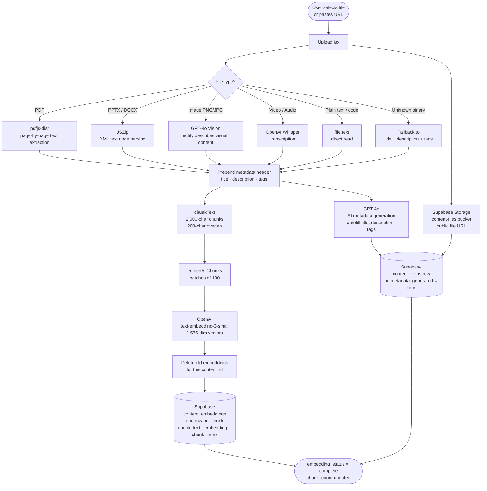

# SE Content Hub — Backend & Architecture Overview

> **For the front-end engineer joining this project.** This document covers everything built on the back end: the database schema, AI pipeline, storage setup, auth model, and what still needs wiring on the front end.

---

## What This Project Is

**SE Content Hub** is an internal content management platform for Sales Engineers. SEs can upload sales assets (decks, videos, demos, docs, code snippets), browse and search the full library, leave ratings and comments, and chat with an AI assistant that has semantic knowledge of all uploaded content.

---

## Tech Stack

| Layer | Choice |
|---|---|
| Front end | React 19 + Vite |
| Database | Supabase (Postgres) |
| Auth | Supabase Auth (email/password) |
| File storage | Supabase Storage (`content-files` bucket) |
| Vector search | pgvector (cosine similarity, 1536-dim) |
| AI / Embeddings | OpenAI (`text-embedding-3-small`, GPT-4o for metadata) |
| Router | Custom page-state in `App.jsx` (not react-router-dom, even though it's installed) |

---

## Environment Variables

Copy `.env.local` and fill in the values. The file already has working keys for the dev project.

```
VITE_SUPABASE_URL=          # Supabase project URL
VITE_SUPABASE_ANON_KEY=     # Supabase anon/public key (safe to expose client-side)
SUPABASE_SERVICE_ROLE_KEY=  # Only used in Node scripts — never expose client-side
SUPABASE_DB_URL=            # Direct Postgres connection string — only for migration scripts
VITE_OPENAI_API_KEY=        # OpenAI key — currently used client-side (dev only; move server-side for prod)
```

---

## Database Schema

All tables live in the `public` schema. Row Level Security (RLS) is enabled on every table.

### `users`
Mirrors `auth.users`. Auto-populated by a trigger when a user signs up. Stores name, email, and avatar URL.

### `content_items`
The core table. Each row is one uploaded asset.

| Column | Notes |
|---|---|
| `content_type` | Enum: `deck`, `video`, `demo`, `doc`, `code` |
| `file_url` | Public URL in Supabase Storage, or an external link |
| `is_external_url` | `true` when the URL points outside Supabase Storage |
| `tags` | `text[]` — array of string tags, indexed with GIN |
| `view_count` / `share_count` | Incremented client-side on events |
| `ai_metadata_generated` | `true` when title/description/tags came from OpenAI |
| `embedding_status` | `none` → `complete` or `failed` after the embedding pipeline runs |
| `extraction_source` | How the text was extracted: `text`, `pdf`, `pptx`, `docx`, `vision`, `whisper`, `metadata` |

### `content_embeddings`
One row per chunk of extracted text. Each chunk has a 1536-dim vector embedding.

- The IVFFlat index on `embedding` makes cosine similarity search fast.
- The `match_content` RPC (Migration v3) wraps the vector search in a clean SQL function.

### `ratings`
1–5 star ratings. One row per `(content_id, user_id)` pair — enforced by a unique constraint.

### `comments`
Threaded comments. `parent_id IS NULL` = top-level comment; `parent_id` set = reply.

### `share_links`
Shareable tokens for individual content items. Support optional password hash and expiry timestamp. The `token` column is a UUID used as the URL slug.

### `chat_sessions` + `chat_messages`
Persistent AI chat. One session per user (enforced by `unique` on `user_id`). Messages store `role` (`user` | `assistant`) and `content`.

### `ideas`
AI-generated content drafts. Stored as `jsonb` in the `artifact` column. Can be promoted to a `content_items` row via `content_item_id`.

---

## Architecture Diagrams

### Upload & Embedding Pipeline



---

### Chat Query & RAG Flow

```mermaid
flowchart TD
    A([User types question\nin Chat.jsx]) --> B[generateEmbedding\nOpenAI text-embedding-3-small\n1 536-dim query vector]

    B --> C[searchSimilarContent\nfetch sourceCount × 4 chunks]
    C --> D[(Supabase RPC\nmatch_content\npgvector cosine similarity\nLIMIT N chunks)]

    D --> E[JS deduplication\nbest chunk per content_id\nsorted by similarity score]
    E --> F[Slice to sourceCount\ndistinct sources]

    F --> G{Any results?}

    G -->|Yes| H[Build CONTEXT block\nSource 1: title · chunk_text\nSource 2: title · chunk_text\n...]
    G -->|No| I[Answer from\ngeneral knowledge only]

    H --> J[Construct OpenAI messages\nsystem: grounding prompt + CONTEXT\nhistory: prior turns\nuser: current question]
    I --> J

    J --> K[OpenAI\ngpt-4o\ntemperature 0.7\nmax_tokens 1 500]
    K --> L[Assistant reply]

    L --> M[Attach deduplicated\nsource cards to message]
    M --> N([Render ChatMessage\nwith Sources chips\nlinked to file_url])

    subgraph Scope control
        SC1[searchScope = all → filter_user_id = null]
        SC2[searchScope = mine → filter_user_id = user.id]
    end
    C -.->|scope param| Scope control
```

---

## AI Pipeline

### 1. Metadata Generation (Upload flow)
On upload, the app extracts text from the file (PDF, PPTX, DOCX, or plain text) and sends it to GPT-4o with a prompt asking for a title, description, and tags. The result is written back to `content_items` with `ai_metadata_generated = true`.

### 2. Embedding Pipeline (`src/lib/embeddings.js`)
After a file is uploaded and metadata is set, the extracted text is chunked and each chunk is embedded via `text-embedding-3-small`. The resulting vectors are written to `content_embeddings`. Embedding status and chunk count are tracked on the `content_items` row.

### 3. Semantic Search (`match_content` RPC)
The AI chat and search features call the `match_content` Postgres function (added in Migration v3). It accepts a query embedding vector and returns the top-N most similar chunks along with their source content metadata.

```sql
select * from match_content(
  query_embedding := <1536-dim vector>,
  match_count     := 5,
  filter_user_id  := null   -- set to a user UUID to scope to their uploads
);
```

---

## Storage

Files are uploaded to the **`content-files`** Supabase Storage bucket.

- Authenticated users can upload.
- Anyone (including unauthenticated) can read (public URLs work).
- Uploaders can delete their own files.

Run `npm run storage:setup` once to create the bucket with the correct policies.

---

## Auth

Supabase email/password auth. `App.jsx` watches `supabase.auth.onAuthStateChange` and gates all pages behind a valid session.

The `public.users` table is kept in sync with `auth.users` via the `on_auth_user_created` trigger — no manual inserts needed.

---

## Pages Built (Current State)

| Page | Route (page-state) | Status |
|---|---|---|
| Sign In | `showSignUp = false` | Built |
| Sign Up | `showSignUp = true` | Built |
| Dashboard | `page = 'dashboard'` | Built |
| Upload | `page = 'upload'` | Built |
| Library | `page = 'library'` | Built |
| Chat | `page = 'chat'` | Built |

**Note:** Navigation is currently managed by a `page` state string in `App.jsx` rather than URL-based routing. If the front end uses `react-router-dom` (it's already in `package.json`), swapping to `<BrowserRouter>` + `<Routes>` is straightforward.

---

## Database Setup & Migrations

```bash
# 1. Install dependencies
npm install

# 2. Copy env file and fill in your Supabase credentials
cp .env.local .env.local   # already there — update keys if needed

# 3. Run the full schema (safe to re-run — uses IF NOT EXISTS throughout)
npm run db:migrate
# or: node scripts/run_migration.js

# 4. Set up the storage bucket
npm run storage:setup

# 5. (Optional) Seed test users
npm run db:seed

# 6. (Optional) Seed sample content
npm run db:seed:content
```

### Migration files

| File | What it does |
|---|---|
| `supabase/schema.sql` | Full baseline schema — run this on a fresh project |
| `supabase/migrate_v2.sql` | Adds file metadata + embedding tracking columns |
| `supabase/migrate_v3.sql` | Adds the `match_content` vector search RPC |

All migrations are idempotent — safe to run multiple times.

---

## Running Locally

```bash
npm install
npm run dev       # starts Vite dev server at http://localhost:5173
npm run build     # production build to /dist
npm run preview   # serve the /dist build locally
```

---

## Features Not Yet Wired to a Front End

These exist fully in the database schema but may not have UI yet depending on what the front-end build covers:

- **Share links** — `share_links` table is there; UI for generating/visiting `/share/:token` URLs is TBD
- **Threaded comments** — `comments` table supports replies via `parent_id`; the threading UI may or may not be built
- **Ideas / drafts** — `ideas` table is ready; a "Drafts" or "AI Ideas" page can promote drafts to published content
- **Per-user content scoping in search** — `match_content` accepts a `filter_user_id` param; front end just needs to pass it
- **View & share count tracking** — columns exist on `content_items`; increment calls need to be added at the right UI events

---

## Key Files

```
src/
  App.jsx              # Auth gate + page-state router
  lib/
    supabase.js        # Supabase client (uses VITE_ env vars)
    embeddings.js      # Text extraction + chunking + OpenAI embedding pipeline
  pages/
    SignIn.jsx
    SignUp.jsx
    Dashboard.jsx
    Upload.jsx         # File upload + AI metadata + embedding trigger
    Library.jsx        # Browse/search content
    Chat.jsx           # AI chat against embedded content

supabase/
  schema.sql           # Full database schema
  migrate_v2.sql       # Metadata + embedding columns
  migrate_v3.sql       # match_content RPC

scripts/
  run_migration.js     # Runs a .sql file against the DB via direct Postgres connection
  seed_users.js        # Creates test user accounts
  seed_content.js      # Seeds sample content items
  setup_storage.js     # Creates the content-files storage bucket
```
